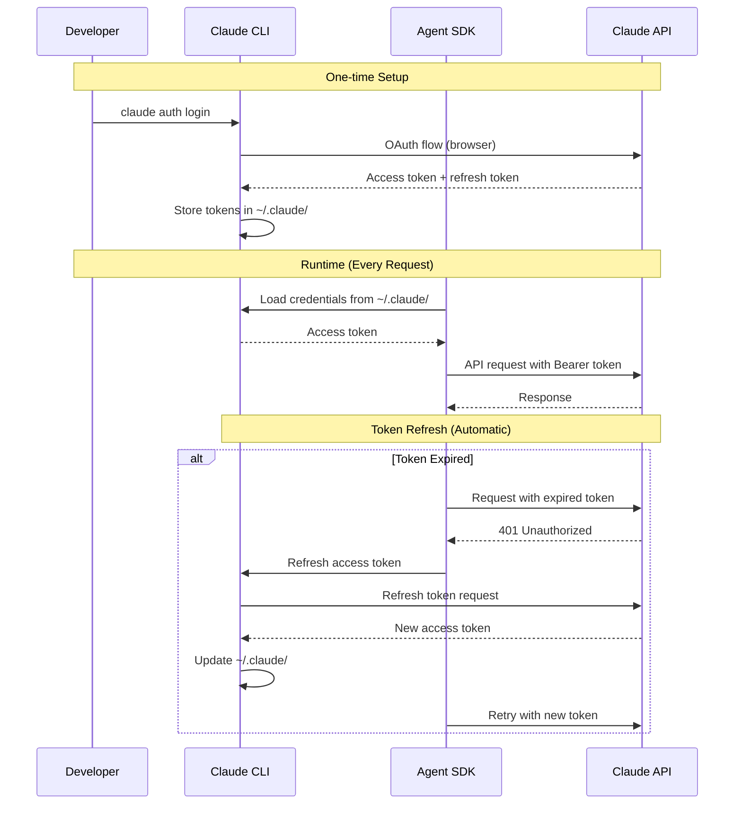

# Backend Architecture

This section defines backend-specific architecture details for the Express server and Agent SDK integration.

## Service Architecture

This application uses a **traditional server architecture** (single Express process), not serverless.

### Controller/Route Organization

```
packages/server/src/
├── server.ts                    # Express app entry point
├── agent/
│   ├── event-loop.ts            # Agent SDK event loop (core logic)
│   ├── system-prompt.ts         # System prompt configuration
│   └── agent-config.ts          # Agent SDK initialization
├── tools/
│   ├── read-json.ts             # read_json custom tool
│   ├── write-json.ts            # write_json custom tool
│   └── write-file.ts            # write_file custom tool
├── socket/
│   └── socket-manager.ts        # Socket.io server setup and event routing
├── utils/
│   ├── logger.ts                # Structured logging utility
│   ├── errors.ts                # Custom error classes (ToolError)
│   └── path-validator.ts        # Path sandboxing validation
└── routes/
    └── health.ts                # Health check endpoint
```

### Controller Template

**Example: Express Server Entry Point**

```typescript
// packages/server/src/server.ts
import express from 'express';
import { createServer } from 'http';
import path from 'path';
import { initializeSocket } from './socket/socket-manager';
import { healthRouter } from './routes/health';
import { logger } from './utils/logger';

const app = express();
const PORT = process.env.PORT || 3000;

// Middleware
app.use(express.json());
app.use(express.static(path.join(__dirname, '../../public')));

// CORS for Vite dev server
app.use((req, res, next) => {
  res.header('Access-Control-Allow-Origin', 'http://localhost:5173');
  res.header('Access-Control-Allow-Credentials', 'true');
  next();
});

// Routes
app.use('/api/health', healthRouter);

// Serve generated HTML pages
app.get('*', (req, res, next) => {
  const filePath = req.path === '/' ? '/index.html' : `${req.path}.html`;
  const fullPath = path.join(__dirname, '../../public', filePath);
  res.sendFile(fullPath, (err) => {
    if (err) {
      next(); // Fall through to 404
    }
  });
});

// 404 handler
app.use((req, res) => {
  res.status(404).json({ error: 'Not found' });
});

// Create HTTP server
const httpServer = createServer(app);

// Initialize Socket.io
initializeSocket(httpServer);

// Start server
httpServer.listen(PORT, () => {
  logger.info(`Server started on port ${PORT}`);
  logger.info(`Chat interface: http://localhost:${PORT}/chat`);
  logger.info(`Generated pages: http://localhost:${PORT}/`);
});
```

## Database Architecture

### Schema Design

**N/A** - Using JSON files, not SQL database. See Section 8 (Database Schema) for file-based storage details.

### Data Access Layer

**File-Based Repository Pattern:**

```typescript
// packages/server/src/tools/read-json.ts
import fs from 'fs/promises';
import path from 'path';
import { validatePath } from '../utils/path-validator';
import { ToolError } from '../utils/errors';
import { logger } from '../utils/logger';

const DATA_DIR = path.join(process.cwd(), 'data');

export const readJson = async (filepath: string): Promise<any> => {
  try {
    // Validate and resolve path
    const fullPath = validatePath(filepath, DATA_DIR);

    logger.debug(`Reading JSON file: ${fullPath}`);

    // Read file
    const content = await fs.readFile(fullPath, 'utf-8');

    // Parse JSON
    const data = JSON.parse(content);

    logger.info(`Successfully read ${filepath}`, {
      size: content.length,
      keys: Object.keys(data).length
    });

    return { success: true, data };
  } catch (error) {
    if ((error as NodeJS.ErrnoException).code === 'ENOENT') {
      throw new ToolError(`File not found: ${filepath}`, 'FILE_NOT_FOUND');
    }
    if (error instanceof SyntaxError) {
      throw new ToolError(`Invalid JSON in ${filepath}`, 'INVALID_JSON');
    }
    throw error;
  }
};

// Tool registration object for Agent SDK
export const readJsonTool = {
  name: 'read_json',
  description: 'Read and parse a JSON file from the /data directory. Returns the parsed JSON content.',
  parameters: {
    type: 'object',
    properties: {
      filepath: {
        type: 'string',
        description: 'Relative path to the JSON file within /data directory (e.g., "products.json")'
      }
    },
    required: ['filepath']
  },
  handler: readJson
};
```

**Path Validation Utility:**

```typescript
// packages/server/src/utils/path-validator.ts
import path from 'path';
import { ToolError } from './errors';

/**
 * Validate that a filepath is within an allowed directory
 * Prevents path traversal attacks (../, absolute paths, symlinks)
 */
export const validatePath = (filepath: string, allowedDir: string): string => {
  // Resolve to absolute path
  const resolvedPath = path.resolve(allowedDir, filepath);

  // Check if path is within allowed directory
  if (!resolvedPath.startsWith(path.resolve(allowedDir))) {
    throw new ToolError(
      `Path traversal detected: ${filepath} is outside ${allowedDir}`,
      'PATH_TRAVERSAL'
    );
  }

  return resolvedPath;
};
```

## Authentication and Authorization

### Auth Flow

**Claude API Authentication:**



**No Application-Level Auth:**
- **Single-user localhost** - No user authentication needed for MVP
- **Claude OAuth only** - Authentication for Claude API access, not for chat interface
- **Future enhancement** - Add user auth for multi-user or deployed versions

### Middleware/Guards

**Error Handling Middleware:**

```typescript
// packages/server/src/server.ts (error handling)
import { ToolError } from './utils/errors';

// Global error handler (Express middleware)
app.use((err: Error, req: express.Request, res: express.Response, next: express.NextFunction) => {
  logger.error('Request error', {
    error: err.message,
    stack: err.stack,
    path: req.path
  });

  if (err instanceof ToolError) {
    return res.status(400).json({
      error: err.message,
      code: err.code
    });
  }

  res.status(500).json({
    error: 'Internal server error'
  });
});
```

**No Authentication Middleware for MVP:**

```typescript
// Future enhancement example:
// app.use('/chat', requireAuth);
// app.use('/api/*', requireAuth);
```

---
