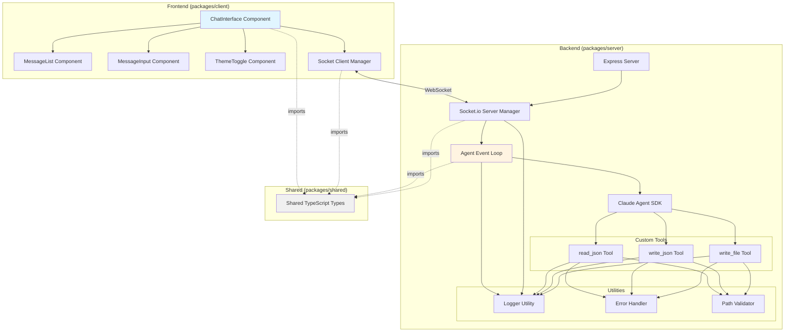

# Components

This section defines the major logical components across the fullstack architecture.

## Express Server (Backend Entry Point)

**Responsibility:** HTTP server initialization, static file serving, Socket.io server setup, and routing

**Key Interfaces:**
- HTTP endpoint: `/api/health` (health check)
- Static file routes: `/` and `/{path}` (serve from `/public`)
- Chat interface route: `/chat` (serve React app)
- Socket.io endpoint: WebSocket connection on same port (3000)

**Dependencies:**
- Express framework
- Socket.io server
- Agent Event Loop component
- File system (serve static files)

**Technology Stack:**
- Express 5 + TypeScript
- Socket.io 4.x server
- Node.js fs module for static serving
- CORS middleware (allow Vite dev server)

**Location:** `packages/server/src/server.ts`

## Agent Event Loop (Core Backend Logic)

**Responsibility:** Orchestrate conversation flow between Socket.io events, Claude Agent SDK, and custom tools

**Key Interfaces:**
- `handleUserMessage(message: string, messageId: string): AsyncIterator<string>` - Process user message, return streaming response
- `initializeAgent(): void` - Initialize Claude Agent SDK with system prompt and tools
- Event handlers for Socket.io events (`user_message`)

**Dependencies:**
- Claude Agent SDK (agent execution)
- Custom tools (read_json, write_json, write_file)
- Socket.io server (emit response chunks)
- Logger utility (structured logging)

**Technology Stack:**
- TypeScript
- Claude Agent SDK (`@anthropic-ai/claude-agent-sdk`)
- Socket.io for event emission
- Custom logger utility

**Location:** `packages/server/src/agent/event-loop.ts`

**Implementation Notes:**
- Incremental build pattern: Basic (Story 2.2) → Streaming (Story 2.3) → Tools (Stories 2.4-2.6)
- Educational clarity: Comprehensive inline comments explaining SDK integration
- Error handling: Try/catch blocks with user-friendly error messages emitted via Socket.io

## Custom Tools (Backend Utilities)

**Responsibility:** Provide domain-agnostic file operations for the agent (read/write JSON, write HTML/CSS/JS)

**Key Interfaces:**
- `readJson(filepath: string): Promise<any>` - Read and parse JSON from `/data`
- `writeJson(filepath: string, content: any): Promise<void>` - Write JSON to `/data`
- `writeFile(filepath: string, content: string): Promise<void>` - Write HTML/CSS/JS to `/public`

**Dependencies:**
- Node.js `fs/promises` (async file operations)
- Path sandboxing utility (validate paths within allowed directories)
- Error handling utility (ToolError class)
- Logger utility

**Technology Stack:**
- TypeScript
- Node.js fs/promises
- Path validation logic

**Location:**
- `packages/server/src/tools/read-json.ts`
- `packages/server/src/tools/write-json.ts`
- `packages/server/src/tools/write-file.ts`

**Security:** All tools enforce path sandboxing - only `/data` and `/public` directories writable

## Socket.io Server Manager (Backend Communication)

**Responsibility:** Manage WebSocket connections, route events to Agent Event Loop, emit streaming responses

**Key Interfaces:**
- `initialize(httpServer: http.Server): void` - Attach Socket.io to Express server
- Event listener: `user_message` → forward to Agent Event Loop
- Event emitter: `agent_response_chunk`, `agent_response_complete`, `error`

**Dependencies:**
- Express HTTP server (attachment point)
- Agent Event Loop (message processing)
- Logger utility

**Technology Stack:**
- Socket.io 4.x server
- TypeScript
- Express HTTP server instance

**Location:** `packages/server/src/socket/socket-manager.ts`

## React Chat Interface (Frontend UI)

**Responsibility:** Display chat messages, handle user input, manage WebSocket connection, render streaming responses

**Key Interfaces:**
- `ChatInterface` component (main UI)
- `MessageList` component (scrollable message history)
- `MessageInput` component (text input + send button)
- `ThemeToggle` component (light/dark mode switch)

**Dependencies:**
- Socket.io client (WebSocket connection)
- shadcn/ui components (Button, Input, ScrollArea, Card)
- Vercel AI Elements (chat UI patterns)
- React state hooks (useState for messages, useContext for theme)

**Technology Stack:**
- React 19 + TypeScript
- Socket.io-client 4.x
- shadcn/ui components
- TailwindCSS 4 for styling
- Vercel AI SDK UI utilities

**Location:** `packages/client/src/components/ChatInterface.tsx`

**State Management:**
- `messages: ChatMessage[]` - Message history (useState)
- `isStreaming: boolean` - Agent response in progress (useState)
- `theme: 'light' | 'dark'` - Theme preference (useContext + localStorage)

## Socket.io Client Manager (Frontend Communication)

**Responsibility:** Establish WebSocket connection, emit user messages, receive streaming chunks, handle reconnection

**Key Interfaces:**
- `connectSocket(): Socket` - Initialize Socket.io client
- `sendMessage(content: string, messageId: string): void` - Emit user_message event
- Event handlers: `agent_response_chunk`, `agent_response_complete`, `error`, `connect`, `disconnect`

**Dependencies:**
- Socket.io client library
- React hooks (useEffect for connection lifecycle)

**Technology Stack:**
- Socket.io-client 4.x
- TypeScript
- React useEffect hook

**Location:** `packages/client/src/hooks/useSocket.ts` (custom React hook)

## Shared Types Package (Cross-Cutting)

**Responsibility:** Provide TypeScript interfaces used by both frontend and backend

**Key Interfaces:**
- `ChatMessage` interface
- `SocketEvent` union types
- `ToolCall` interface
- `ToolResult` type

**Dependencies:** None (pure TypeScript types)

**Technology Stack:** TypeScript

**Location:** `packages/shared/src/types.ts`

**Purpose:** Eliminate type mismatches between client and server, enable refactoring confidence

## Utility Components (Backend)

**Responsibility:** Reusable utilities for logging, error handling, path validation

**Key Interfaces:**
- Logger: `logger.info()`, `logger.warn()`, `logger.error()`, `logger.debug()`
- ToolError: Custom error class for tool failures
- Path validator: `validatePath(filepath: string, allowedDir: string): string`

**Dependencies:** None (standalone utilities)

**Technology Stack:** TypeScript, Node.js

**Location:**
- `packages/server/src/utils/logger.ts`
- `packages/server/src/utils/errors.ts`
- `packages/server/src/utils/path-validator.ts`

## Component Diagram

---
