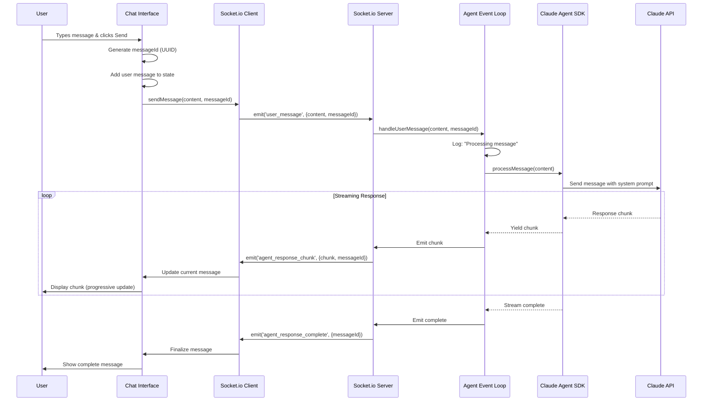
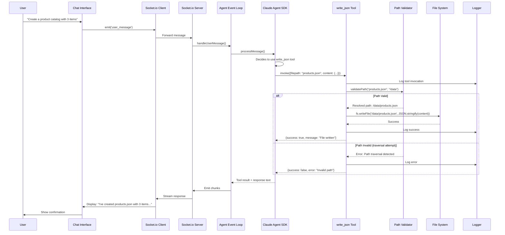
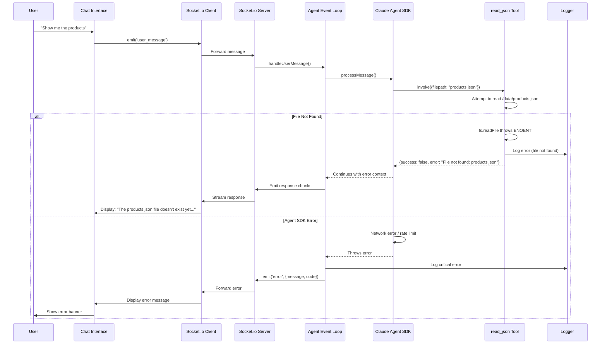
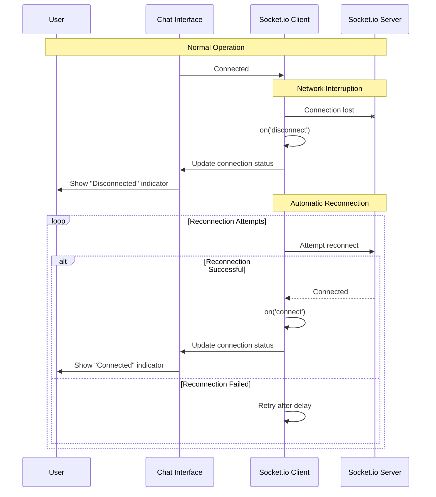
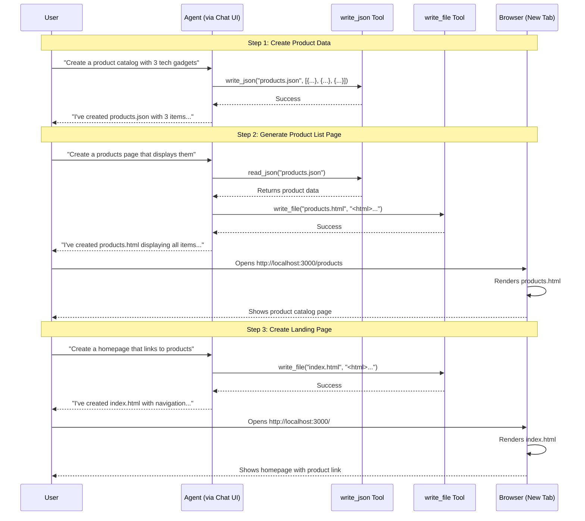

# Core Workflows

These sequence diagrams illustrate the key system workflows showing component interactions.

## User Message → Agent Response (Happy Path)

## Agent Tool Invocation (write_json Example)

## Error Handling Workflow

## WebSocket Reconnection Workflow

## Complete Demo Sequence (Product Catalog → Landing Page)

---
