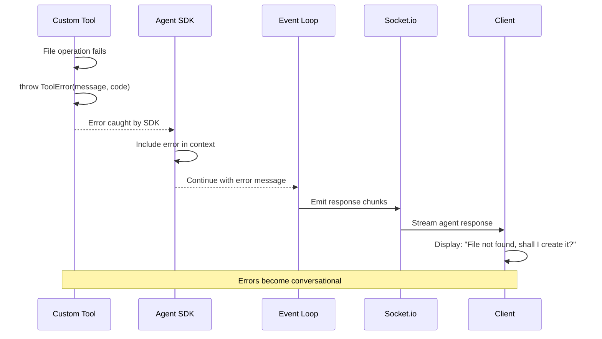

# Error Handling Strategy

## Error Flow



## Error Response Format

```typescript
// Shared error interface
interface ApiError {
  error: {
    code: string;           // ERROR_CODE (TOOL_ERROR, FILE_NOT_FOUND, etc.)
    message: string;        // User-friendly message
    details?: Record<string, any>;  // Optional additional context
    timestamp: string;      // ISO 8601 timestamp
    requestId: string;      // For debugging correlation
  };
}
```

## Frontend Error Handling

```typescript
// packages/client/src/hooks/useSocket.ts (error handling)
socket.on('error', (data: { message: string; code?: string }) => {
  console.error('Socket error:', data);

  // Add error message to chat
  addMessage({
    id: crypto.randomUUID(),
    role: 'assistant',
    content: `❌ Error: ${data.message}`,
    timestamp: Date.now(),
    status: 'error'
  });
});
```

## Backend Error Handling

```typescript
// packages/server/src/utils/errors.ts
export class ToolError extends Error {
  code: string;

  constructor(message: string, code: string = 'TOOL_ERROR') {
    super(message);
    this.name = 'ToolError';
    this.code = code;
  }
}

// Usage in tools:
throw new ToolError('File not found: products.json', 'FILE_NOT_FOUND');
throw new ToolError('Path traversal detected', 'PATH_TRAVERSAL');
throw new ToolError('Invalid JSON format', 'INVALID_JSON');
```

---
