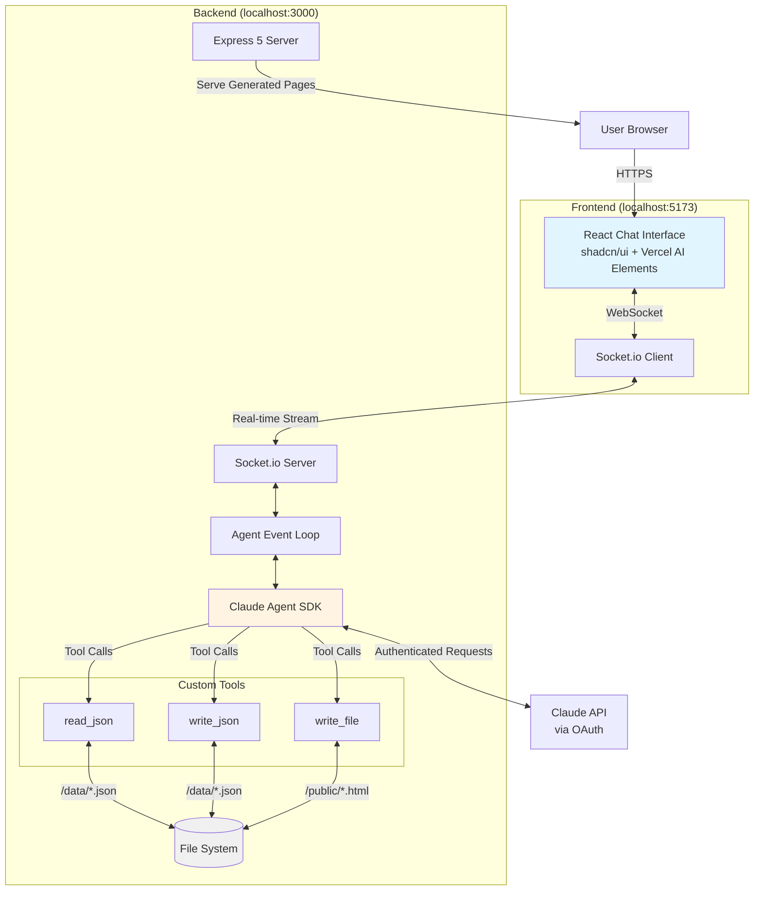

# High Level Architecture

## Technical Summary

This architecture implements a **monorepo-based, conversational web application** that enables users to build and modify software through natural language chat. The system uses **NPM workspaces** to organize three packages (server, client, shared), with an **Express 5 backend** running the Claude Agent SDK event loop and a **React 19 + Vite 7 frontend** providing the chat interface. Real-time bidirectional communication flows through **Socket.io**, streaming agent responses as they're generated. The backend exposes three domain-agnostic custom tools (`read_json`, `write_json`, `write_file`) that enable the agent to manipulate JSON data files and generate HTML/CSS/JS pages through conversation. This minimal framework (~200-250 LOC) demonstrates how Claude Agent SDK can be integrated with quality gates while maintaining educational clarity, deployed locally on `localhost:3000` (Express) with Vite dev server on `localhost:5173`.

## Platform and Infrastructure Choice

**Platform:** Local Development (Localhost)
**Key Services:**
- Node.js 20+ runtime (server execution)
- Express 5 (HTTP server + static file serving)
- Socket.io (WebSocket server for real-time streaming)
- Vite 7 dev server (frontend HMR during development)
- Claude Agent SDK (via OAuth, no separate service)
- File system (JSON in `/data`, HTML/CSS/JS in `/public`)

**Deployment Host and Regions:** Single-user localhost only for MVP (no cloud deployment)

## Repository Structure

**Structure:** Monorepo (single repository, multiple packages)
**Monorepo Tool:** NPM Workspaces (native npm functionality, no additional tooling)
**Package Organization:** Three-package structure with shared TypeScript types

```
packages/
├── server/          # Express + Agent SDK backend
├── client/          # React + Vite frontend
├── shared/          # Shared TypeScript types/utilities
```

## High Level Architecture Diagram



## Architectural Patterns

- **Monorepo Architecture** - Single repository with NPM workspaces for server, client, and shared packages - _Rationale:_ Enables shared TypeScript types, atomic commits, and simplified dependency management for educational demo
- **Event-Driven Agent Loop** - Agent SDK processes messages through event-driven loop with custom tool integration - _Rationale:_ Clean separation of concerns, testable incremental build (basic → streaming → tools), educational clarity
- **Domain-Agnostic Tools Pattern** - Three generic file operation tools (read_json, write_json, write_file) with no business logic - _Rationale:_ Framework doesn't "know about" products/blogs, evolves based on conversation, demonstrates extensibility
- **Real-Time Streaming (Socket.io)** - Bidirectional WebSocket communication for streaming agent responses - _Rationale:_ Superior UX for progressive response display, handles backpressure, works across all browsers
- **Path Sandboxing** - Strict enforcement of writable directories (`/data` and `/public` only) - _Rationale:_ Security constraint for educational demo, prevents accidental system file modification
- **Component-Based UI (React)** - Reusable React components with TypeScript for type safety - _Rationale:_ Modern best practice, extensive ecosystem, familiar to target developers
- **Utility-First CSS (TailwindCSS)** - Atomic CSS classes for rapid styling - _Rationale:_ Minimal custom CSS, consistent design system, fast iteration
- **Shared Type System** - TypeScript interfaces in `/packages/shared` consumed by both frontend and backend - _Rationale:_ Eliminates type mismatches, enables refactoring confidence, educational value for monorepo patterns

---
